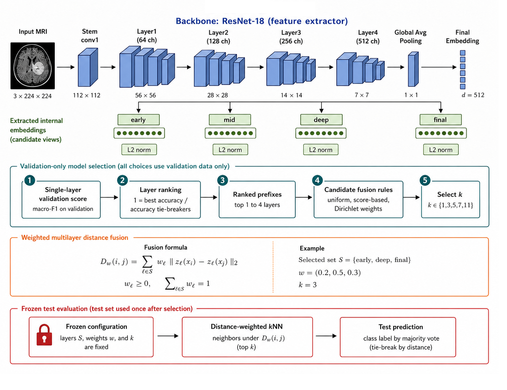

# HMDF-kNN

Hierarchical Multilayer Distance Fusion kNN is a post-hoc classifier for
internal CNN embeddings. It ranks candidate layer views using validation data,
constructs ranked layer prefixes, selects a weighted fusion of layer-wise
distance matrices, and freezes the selected kNN configuration before test
evaluation.

This repository contains:

- a readable standalone HMDF-kNN implementation;
- the exact audited benchmark runner used for the paper;
- independent multilayer and multiview reference implementations;
- compact result matrices, figures, and tables;
- the corrected manuscript and supplementary material;
- an executable tutorial that does not require medical images.



## Main audited result

The principal evaluation contains **45 brain-MRI contexts**:

`5 brain-MRI datasets x 9 CNN backbones`

HAM10000 contributes nine additional contexts but is treated only as an
external-domain control. It is excluded from the main brain-MRI means, counts,
and inferential tests.

| Method family | Mean test macro-F1 |
|---|---:|
| Softmax head | 0.9326 |
| Final-embedding classifiers | 0.9470 |
| Multilayer reference methods | 0.9550 |
| HMDF-kNN | **0.9616** |

HMDF-kNN also obtained mean accuracy `0.9683` and balanced accuracy `0.9597`.
These are aggregate results, not evidence of uniform superiority or clinical
deployment readiness.

The final audit is available in
[`docs/FINAL_GITHUB_AUDIT.md`](docs/FINAL_GITHUB_AUDIT.md).
Release-specific execution checks are recorded in
[`docs/RELEASE_VALIDATION.md`](docs/RELEASE_VALIDATION.md).

## Method

For every dataset-backbone context:

1. Extract internal embeddings from a fine-tuned CNN.
2. L2-normalize each layer view independently.
3. Evaluate each layer with distance-weighted kNN on validation data.
4. Rank layers by validation macro-F1, balanced accuracy, and accuracy.
5. Construct prefixes containing the top one to four layers.
6. Evaluate uniform, score-based, and reproducible Dirichlet distance weights.
7. Select `k` from `{1, 3, 5, 7, 11}` using validation data.
8. Freeze the complete configuration.
9. Evaluate test once using the fused distance matrix.

The default search evaluates 185 validation candidates when at least four
candidate views are available.

## Repository structure

```text
HMDF-kNN/
├── README.md
├── requirements.txt
├── requirements-gpu.txt
├── configs/
├── data/
├── models/
│   ├── hmdf_knn.py
│   ├── backbone.py
│   ├── feature_extractor.py
│   └── benchmark_models.py
├── pipelines/
│   ├── run_hmdf.py
│   ├── run_raw_literature_multidim_competitors.py
│   ├── build_result_matrices_for_paper.py
│   ├── prepare_hmdf_results_section.py
│   └── audit_hmdf_github_readiness.py
├── inference/
├── notebooks/
├── results/
├── paper/
├── docs/
└── tests/
```

## Quick start

Create an environment:

```bash
python -m venv .venv
```

Windows:

```powershell
.\.venv\Scripts\Activate.ps1
pip install -r requirements.txt
```

Linux/macOS:

```bash
source .venv/bin/activate
pip install -r requirements.txt
```

Run the friendly tutorial:

```bash
jupyter lab notebooks/HMDF_kNN_friendly_walkthrough.ipynb
```

Run tests:

```bash
pytest -q
```

## Run on a saved embedding profile

Validate its structure:

```bash
python data/prepare_data.py --profile /path/to/profile
```

Run HMDF-kNN:

```bash
python pipelines/run_hmdf.py \
  --profile /path/to/profile \
  --output results/runs/example
```

The output contains:

- `selected_configuration.json`;
- `test_predictions.npz`;
- `summary.json`.

## Exact paper benchmark

The exact audited runner is:

```text
pipelines/run_raw_literature_multidim_competitors.py
```

It compares HMDF-kNN against raw concatenation, PCA, uniform soft voting,
uniform kernel SVM, MLCFF-style fusion, Head2Toe-style fusion, EasyMKL,
MAXVAR-GCCA, GMLDA, MvDA, NCA+kNN, and related controls using the same saved
embedding views and splits.

Implementation fidelity and adaptations are documented in:

- [`docs/METHOD_FIDELITY_AND_PROTOCOL.md`](docs/METHOD_FIDELITY_AND_PROTOCOL.md)
- [`docs/METHOD_ADAPTATIONS.md`](docs/METHOD_ADAPTATIONS.md)

## Reproduce paper assets

Compact source matrices are under `results/metrics/`.

The final scripts are:

```bash
python pipelines/build_result_matrices_for_paper.py
python pipelines/prepare_hmdf_results_section.py
python pipelines/audit_hmdf_github_readiness.py
```

The complete local reproduction additionally requires saved prediction and
embedding artifacts that are not committed because of size and data licensing.
The audit explicitly marks unavailable per-sample predictions for the
validation-selected final-embedding baseline.

## Important limitations

- The main experiment uses one seed (`42`).
- Patient-level separation could not be verified from available metadata.
- Several literature methods are stage-level adaptations over saved CNN
  embeddings, not complete end-to-end reproductions.
- The method is evaluated as a research classifier, not as a clinically
  validated diagnostic system.
- Data, checkpoints, and full embedding arrays are not redistributed here.

## Paper

- [`paper/HMDF-kNN_paper.pdf`](paper/HMDF-kNN_paper.pdf)
- [`paper/supplementary/HMDF-kNN_supplement.pdf`](paper/supplementary/HMDF-kNN_supplement.pdf)

## License

A software license must be selected before making the repository public.
Dataset licenses remain controlled by their original providers.
